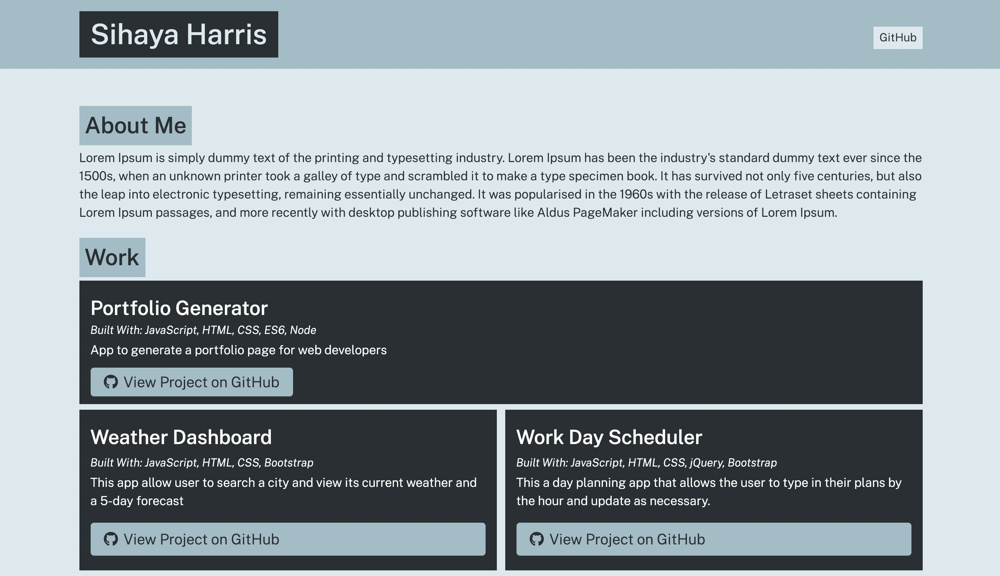

# Portfolio Generator

repo: https://github.com/sihayah/portfolio-generator

This app allows the user to answer a series of questions in Node.js. The answers are then used to generate an HTML portfolio page.

To use this app, the user must download from the above repo and, also, have Node downloaded locally.

This application was created with Node.js, javaScript, and CSS.
